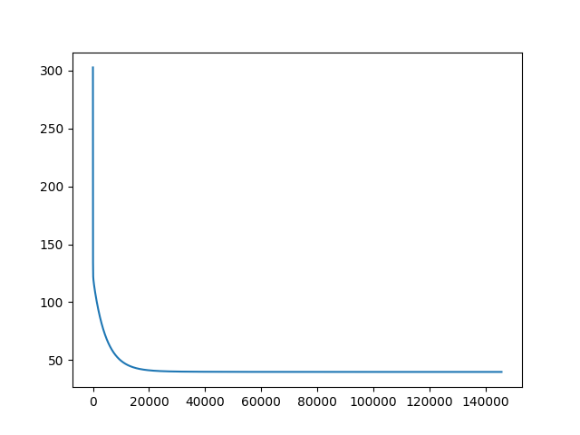
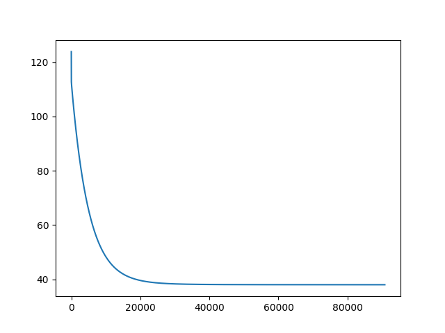

# ML ASSIGNMENT-2 Report

Varun Chhangani(S20170010173)

Dilip Jat(S20170010043)

## Perceptron

A perceptron is a neural network unit (an artificial neuron) that does certain computations to detect features or business intelligence in the input data. It was introduced by Frank Rosenblatt in 1957.

It is basically an algorithm for supervised learning of a **binary classifier.** It learns the weight of training data and decides the linear decision boundary. This helps you to distinguish between 2 classes.

## Linear Regression

In statistics, simple linear regression is a linear regression model with a single explanatory variable That is, it concerns two-dimensional sample points with one independent variable and one dependent variable (conventionally, the *x* and *y* coordinates in a Cartesian coordinate system) and finds a linear function (a non-vertical straight line) that, as accurately as possible, predicts the dependent variable values as a function of the independent variables.

## Gradient Descent

In linear regression, the model targets to get the best-fit regression line to predict the value of y based on the given input value (x). While training the model, the model calculates the cost function which measures the Root Mean Squared error between the predicted value (pred) and true value (y). The model targets to minimize the cost function.

To minimize the cost function, the model needs to have the best value of θ1 and θ2. Initially model selects θ1 and θ2 values randomly and then iteratively update these value in order to minimize the cost function until it reaches the minimum. By the time model achieves the minimum cost function, it will have the best θ1 and θ2 values. Using these finally updated values of θ1 and θ2 in the hypothesis equation of linear equation, the model predicts the value of x in the best manner it can.

## DATASET1:

*Yacht hydrodynamics*

**Description**:  

It contains 308 examples. Each example has 6 input features and a label(the last column). Dataset is shuffled and the first 200 examples are considered for training and rest for testing.

**Hyperparameters**: 

Learning rate: 0.01

Threshold: 0.1

To run:

```bash
python3 Group1_Q1.py
```


We stop updating the weights(either randomly initialised or initialised with zeros) once the difference with the previous weights is less than a certain threshold.

**Upon running**:

Run 1:

Initial W [0.83, 5.07, 1.02, 2.66, 8.73, 3.07, 5.86]


Initial Error: 849.7443863629184


Final W [-9.743715157878095, -0.040557961702349606, -11.721753568336975, 4.578986710615607, -2.654018196578395, -6.529009709535542, 128.48723967861207]


Training Error: 39.762612577329215


Testing Error: 40.20866774382663


r squared error training 0.6322


r squared error testing 0.5938





**Run 2**:


Initial W [0, 0, 0, 0, 0, 0, 0]


Initial Error: 169.62337321428572


Final W [-14.80182807458941, 0.12447195005352951, -8.732046921736517, -1.239493185461609, -0.1785733822346914, 0.6926031164567223, 121.85175599464152]


Training Error: 38.04000255718671


Testing Error: 41.64285375715338


r squared error training 0.6327 


r squared error testing 0.6006




**DATASET2:**

*Iris dataset*

**Description**:  

It contains 100 examples. Each example has 4 input features and a label(the last column). Dataset is shuffled and the first 70 examples are considered for training and rest for testing.

**Hyperparameters**: 

Learning rate: 0.01

Number of iterations: 20000

To run:

```bash
python3 Group1_Q2.py
```


We run the training for a fixed number of iterations and evaluate the error by finding the number of misclassified examples on the test set. We also compare our results with that of the training set. We see that there is always some error on the training set which means the dataset is not linearly separable.

**Upon running:**

**Run 1**

Initial W [5.0, 3.0, 9.0, 5.0, 3.0]


Initial Error: 0.5


Final W [12.32, 12.795999999999905, 17.18199999999997, -21.910000000000014, -19.970000000000002]


Training Classification Error:0.0


Testing Classification Error:0.06666666666666667


**Run 2**


Initial W [4.0, 3.0, 7.0, 9.0, 5.0]


Initial Error: 0.5


Final W [10.839999999999968, 11.84999999999993, 11.252000000000066, -18.39000000000004, -15.649999999999812]


Training Classification Error:0.0


Testing Classification Error:0.03333333333333333